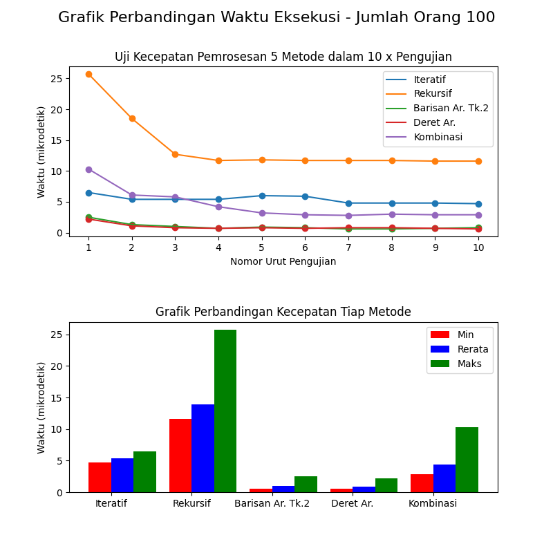

## Jumlah Jabat Tangan (Salaman).
###### Developed by [Galih Hermawan](https://galih.eu) || [Blog](https://blog.galih.eu).
---

#### Deskripsi.
Solusi untuk menghitung jumlah jabat tangan dari sejumlah orang.

Terdapat 5 metode untuk menghitung jumlah salaman.
1. Metode iteratif
2. Metode rekursif
3. Metode barisan aritmatika bertingkat dua
4. Metode menghitung deret aritmatika (jumlah suku)
5. Metode kombinasi (faktorial)

**Keterangan.**
- Fail 1_list_salaman.py -> daftar orang yang terlibat dalam jabat tangan
- Fail no_7_Uji_Kecepatan.py -> hasil uji kecepatan eksekusi masing-masing metode
- Fail no_7b_Uji_Kecepatan_dan_grafik.py -> idem + grafik
  - *Reqs module*: numpy & matplotlib

------

Contoh grafik dengan nilai jumlah orang = 100, jumlah pengujian = 10 kali.

